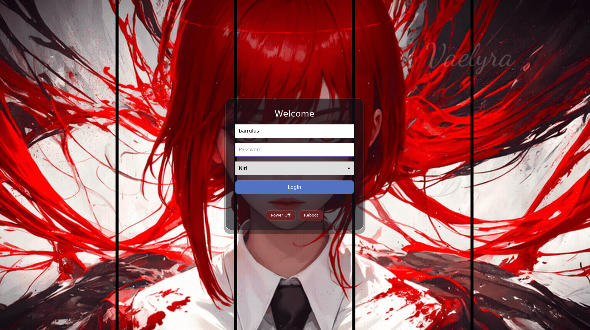

# barrgreet

A minimal login greeter for [greetd](https://sr.ht/~kennylevinsen/greetd/), built with Rust using [iced](https://iced.rs) and [iced_layershell](https://github.com/waycrate/exwlshelleern).



## Features

- Wayland-native via layer shell (covers the full screen on the `Top` layer)
- Auto-detects available Wayland and X11 sessions from `.desktop` files
- Glass-card UI with keyboard navigation (Tab to switch fields, Enter to login)
- Power off and reboot buttons

## Building

### With Nix (recommended)

```sh
nix build
```

### With Cargo

Requires `wayland`, `libxkbcommon`, and `vulkan-loader` development libraries.

```sh
cargo build --release
```

## Usage

Configure greetd to run barrgreet as its greeter. For example, in `/etc/greetd/config.toml`:

```toml
[default_session]
command = "barrgreet"
```

### NixOS

```nix
{
  services.greetd = {
    enable = true;
    settings.default_session.command = "${pkgs.barrgreet}/bin/barrgreet";
  };
}
```

Or if using the flake directly:

```nix
{
  services.greetd = {
    enable = true;
    settings.default_session.command = "${inputs.barrgreet.packages.x86_64-linux.default}/bin/barrgreet";
  };
}
```

## Session Detection

Sessions are discovered from `.desktop` files in:

- `/usr/share/wayland-sessions`
- `/usr/share/xsessions`
- `/run/current-system/sw/share/wayland-sessions` (NixOS)
- `/run/current-system/sw/share/xsessions` (NixOS)

## License

[MIT](LICENSE)
