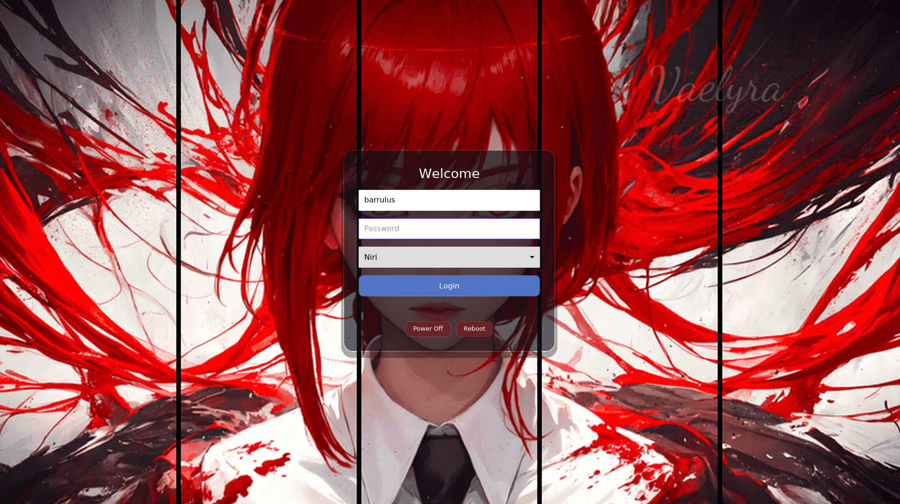

# barrgreet

A minimal login greeter for [greetd](https://sr.ht/~kennylevinsen/greetd/), built with Rust using [iced](https://iced.rs) and [iced_layershell](https://github.com/waycrate/exwlshelleern).



## Features

- Wayland-native via layer shell (covers the full screen on the `Top` layer)
- Auto-detects available Wayland and X11 sessions from `.desktop` files
- Glass-card UI with keyboard navigation (Tab to switch fields, Enter to login)
- Power off and reboot buttons

## Building

### With Nix (recommended)

```sh
nix build
```

### With Cargo

Requires `wayland`, `libxkbcommon`, and `vulkan-loader` development libraries.

```sh
cargo build --release
```

## Usage

Configure greetd to run barrgreet as its greeter. For example, in `/etc/greetd/config.toml`:

```toml
[default_session]
command = "barrgreet"
```

### NixOS

```nix
{
  services.greetd = {
    enable = true;
    settings.default_session.command = "${pkgs.barrgreet}/bin/barrgreet";
  };
}
```

Or if using the flake directly:

```nix
{
  services.greetd = {
    enable = true;
    settings.default_session.command = "${inputs.barrgreet.packages.x86_64-linux.default}/bin/barrgreet";
  };
}
```

## Running under a compositor (e.g. niri)

barrgreet has a transparent background, so you'll want a compositor to provide wallpaper and window management. Here's an example using [niri](https://github.com/YaLTeR/niri):

**greetd config** (NixOS `configuration.nix`):

```nix
services.greetd.enable = true;
services.greetd.settings.default_session.command = lib.mkForce
  "${pkgs.dbus}/bin/dbus-run-session ${lib.getExe pkgs.niri} --config /etc/greetd/niri-greeter.kdl";
```

**niri-greeter.kdl** (minimal example):

```kdl
hotkey-overlay {
    skip-at-startup
}

// Launch barrgreet, quit niri when it exits
spawn-at-startup "barrgreet" ; "niri" "msg" "action" "quit" "--skip-confirmation"
```

### Wallpaper

barrgreet is transparent by design — add a wallpaper process in your niri config.

**Animated wallpaper with [mpvpaper](https://github.com/GhostNaN/mpvpaper):**

```kdl
spawn-at-startup "mpvpaper" "*" "/path/to/wallpaper.gif" "-o" "no-audio --loop"
```

**Static wallpaper with [swaybg](https://github.com/swaywm/swaybg):**

```kdl
spawn-at-startup "swaybg" "-i" "/path/to/wallpaper.png" "-m" "fill"
```

### Troubleshooting

barrgreet logs startup diagnostics to stderr. Check the greetd journal for errors:

```sh
journalctl -u greetd -e
```

You should see output like:

```
[barrgreet] starting
[barrgreet] WAYLAND_DISPLAY=wayland-1
[barrgreet] GREETD_SOCK=/run/greetd.sock
[barrgreet] found 3 session(s): Niri, Plasma (Wayland), Sway
[barrgreet] launching layer-shell UI
```

## Session Detection

Sessions are discovered from `.desktop` files in:

- `/usr/share/wayland-sessions`
- `/usr/share/xsessions`
- `/run/current-system/sw/share/wayland-sessions` (NixOS)
- `/run/current-system/sw/share/xsessions` (NixOS)
- `/usr/local/share/wayland-sessions`
- `/usr/local/share/xsessions`

## License

[MIT](LICENSE)
